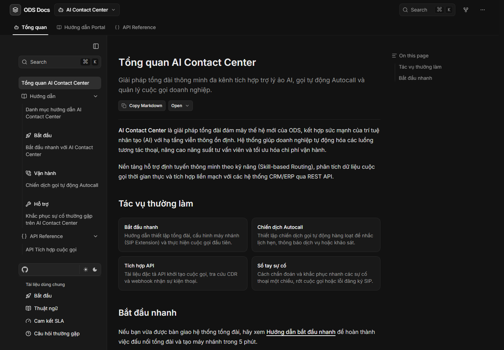
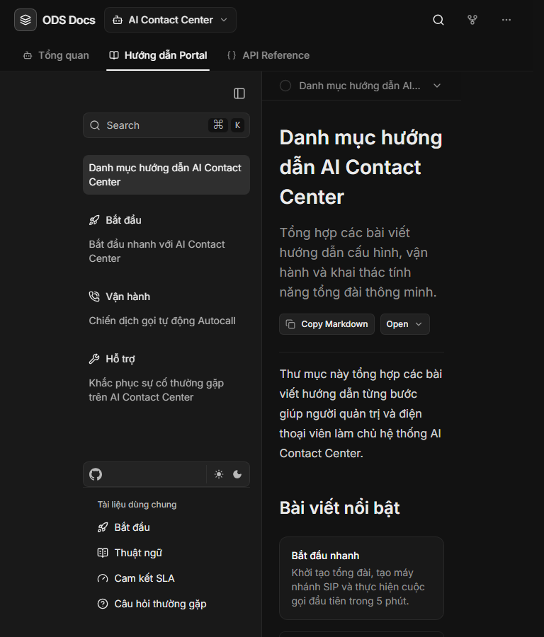
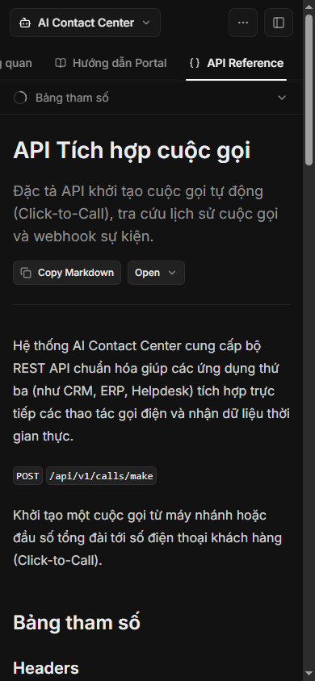

# Báo cáo nghiệm thu TASK-005 — Hoàn thiện bố cục và điều hướng `/docs`

- **Task**: `tasks/TASK-005-hoan-thien-bo-cuc-docs.md`
- **Branch**: `task/TASK-005-hoan-thien-bo-cuc-docs`
- **Trạng thái**: `done`
- **Kiểm chứng bởi**: `npm run verify:task`

## 1. File thay đổi

### Tạo mới

- `src/components/docs-container.tsx` — grid container giữ sticky offset cho header, sidebar và TOC.
- `src/components/top-nav.tsx` — solution switcher, contextual tabs, Search, utility menu và mobile sidebar trigger.
- `src/lib/docs-navigation.ts` — typed navigation model và longest-prefix route matching.
- `.harness/reports/assets/TASK-005/*.png` — bằng chứng visual desktop, tablet và mobile.

### Sửa đổi

- `src/app/docs/layout.tsx` — lắp custom slots vào `DocsLayout`, giữ sidebar/footer Fumadocs.
- `src/app/global.css` — header height, tab scrollbar và single-column mobile grid.
- `src/lib/layout.shared.tsx` — bật nav slot để custom header được render.

Không sửa content, route, dependency, auth, proxy hoặc search source.

## 2. Kiểm chứng tự động

- `npm run typecheck` — exit code `0`.
- `npm run check:links` — exit code `0`, toàn bộ liên kết nội bộ hợp lệ.
- `git diff --check` — exit code `0`; chỉ có cảnh báo Git về LF/CRLF, không có whitespace error.
- `npm run verify:task` — exit code `0`:
  - `types:check`: generated route types và TypeScript PASS.
  - `check:env`: PASS.
  - `check:links`: PASS.
  - `guard`: `Guard PASS.`
  - `check:scope`: toàn bộ file nằm trong TASK-005.
  - production build: compiled và sinh đủ 62 static pages.
  - route tests: PASS `7/7`; `/docs` và public search trả `200`, internal pages/search trả `401`.

Build vẫn in cảnh báo `metadataBase` chưa được cấu hình. Đây là cảnh báo baseline ngoài phạm vi TASK-005, không phát sinh từ navigation.

## 3. Runtime và interaction

Kiểm thử trên production build tại viewport `390×844` và `1440×1000` bằng Chrome DevTools Protocol:

- Active tab của `/docs/ai-contact-center/api` là `API Reference`.
- Các control mobile đều nằm trong viewport; cạnh phải xa nhất là `363px/390px`.
- Solution switcher mở đủ Hub, AI Contact Center và CloudFile.
- `Escape` đóng solution menu và trả focus về trigger.
- Utility menu mobile mở đủ GitHub, Blog, Hỗ trợ 24/7 và ODS ID.
- Mobile sidebar drawer mở thành công.
- Desktop Search mở dialog và search input của Fumadocs.
- Kết quả interaction probe: `passed: true`.

In-app browser connector không có `node_repl` callable trong phiên nghiệm thu, nên visual/runtime được kiểm chứng bằng Chrome/Edge headless cục bộ trên production server.

## 4. Bằng chứng visual

### Desktop — 1440×1000

### Tablet — 768×900

### Mobile — 390×844

## 5. Trạng thái bàn giao

Implementation và local verification đã hoàn tất. Pull Request #5 đã được merge vào `main` tại commit `3ebeaf5`; required check `verify` hoàn tất với kết quả `success`. TASK-005 được chuyển sang `done`, với commit implementation `732faa6` được ghi trong task frontmatter.
