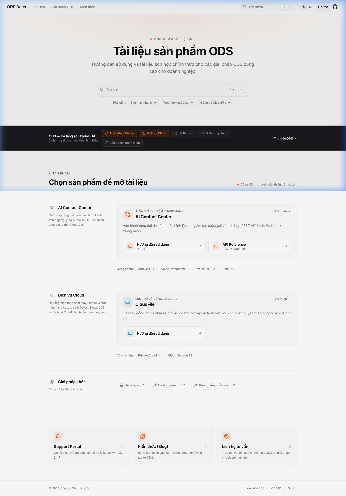
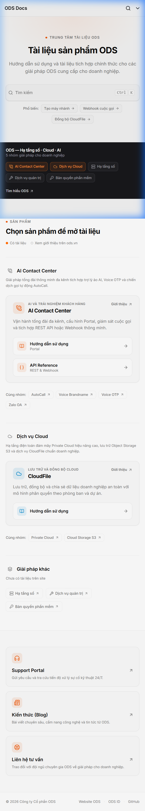

# Báo cáo Nghiệm thu — TASK-011

## Thông tin nhiệm vụ

- **Mã task**: TASK-011 — Home hub dạng danh mục tài liệu
- **Nhánh**: `task/TASK-011-home-hub-directory`
- **Trạng thái**: `in-progress` (sẵn sàng mở PR)
- **Lệnh kiểm chứng**: `npm run verify:task`

---

## 1. Tóm tắt thay đổi

Chuyển trang chủ (`src/app/(home)/page.tsx`) từ bố cục 7 section phân tán chi tiết sang Home hub 5 khối tinh gọn định hướng danh mục tài liệu ODS:

1. **Hero**: Căn giữa, eyebrow "Trung tâm tài liệu ODS", H1 "Tài liệu sản phẩm ODS", mô tả ngắn, `FullSearchTrigger` lớn và gợi ý tìm kiếm phổ biến.
2. **Dải giới thiệu ODS**: Banner nền tối cao ~80px hiển thị 5 nhóm giải pháp ODS (nhóm có tài liệu viền cam, nhóm chưa có viền xám) và link tìm hiểu ods.vn.
3. **Danh mục sản phẩm**: Nhóm theo giải pháp ODS (grid 240px | 1fr):
   - Cột trái: Icon nhóm + Tên + Mô tả ngắn.
   - Cột phải: Thẻ sản phẩm có tài liệu (AI Contact Center & CloudFile) hiển thị các entry link dẫn vào tài liệu (`user-guider-portal`, `api`, `cloudfile`), kèm danh sách chip viền đứt cho các sản phẩm chưa có docs trong cùng nhóm.
   - Hàng cuối "Giải pháp khác": Gom các nhóm giải pháp chưa có tài liệu trên site dạng chip viền đứt liên kết tới ods.vn.
4. **Hỗ trợ**: 3 thẻ liên kết ngang tới Support Portal, Kiến thức (Blog) và Liên hệ tư vấn.
5. **Footer**: 1 dòng tinh gọn bản quyền và liên kết ODS Website, ODS ID, GitHub.

---

## 2. Danh sách file thay đổi

### Tạo mới:
- `tasks/TASK-011-home-hub-directory.md`
- `.harness/reports/TASK-011-report.md`
- `.harness/reports/assets/TASK-011/desktop-1440px.png`
- `.harness/reports/assets/TASK-011/mobile-390px.png`

### Sửa đổi:
- `src/lib/docs-products.ts` (thêm `entries` cho từng product profile)
- `src/lib/home-content.ts` (thu gọn model, chỉ giữ lại `searchSuggestions` và hàm validate internal link)
- `src/app/(home)/page.tsx` (viết lại bố cục 5 khối, không hard-code bất kỳ href `/docs/...` nào)
- `src/app/global.css` (làm sạch CSS cũ, thêm style cho hero, chip, product card, entry link, support card)
- `harness/tests/routes.test.mjs` (cập nhật chuỗi kiểm tra nội dung trang Home phù hợp contract mới)

### Xóa:
- `src/components/home/hero-preview.tsx`
- `src/components/home/role-guides.tsx`

---

## 3. Kết quả kiểm chứng tự động

```bash
> ods-docs@0.0.28 verify:task
> npm run verify:code && npm run check:scope && npm run build && npm run test:routes

> ods-docs@0.0.28 types:check
> next typegen && tsc --noEmit
Generating route types...
✓ Types generated successfully

> ods-docs@0.0.28 check:env
> node harness/linters/env-guard.mjs
[env-guard PASS] Toàn bộ file cấu hình môi trường đều an toàn.

> ods-docs@0.0.28 check:links
> node harness/linters/broken-links.mjs
[Linter] Toàn bộ liên kết nội bộ trong MDX đều hợp lệ.

> ods-docs@0.0.28 guard
> node harness/guard.mjs
Guard - giai doan: internal
Guard PASS.

> ods-docs@0.0.28 check:scope
> node harness/linters/scope-check.mjs
[scope-check PASS] Toàn bộ file thay đổi đều nằm trong phạm vi của TASK-011.

> ods-docs@0.0.28 build
> next build
▲ Next.js 16.3.4 (Turbopack)
✓ Compiled successfully in 44s
✓ Generating static pages using 3 workers (170/170) in 6.1s

> ods-docs@0.0.28 test:routes
> node harness/tests/routes.test.mjs
[test:routes] Khởi động Next production server tại http://127.0.0.1:60179...
[test:routes] Server đã sẵn sàng. Bắt đầu kiểm tra 12 cases:
  ✓ Home hub accessible [/] -> mong đợi 200, thực tế 200, nội dung đúng
  ✓ Public docs accessible [/docs] -> mong đợi 200, thực tế 200
  ✓ AI Contact Center docs accessible [/docs/ai-contact-center] -> mong đợi 200, thực tế 200
  ✓ CloudFile docs accessible [/docs/cloudfile] -> mong đợi 200, thực tế 200
  ✓ Portal guide accessible [/docs/ai-contact-center/user-guider-portal] -> mong đợi 200, thực tế 200
  ✓ API reference accessible [/docs/ai-contact-center/api] -> mong đợi 200, thực tế 200
  ✓ Public search API accessible [/api/search] -> mong đợi 200, thực tế 200
  ✓ Internal root blocked [/internal] -> mong đợi 401, thực tế 401
  ✓ Internal trailing slash blocked [/internal/] -> mong đợi 401, thực tế 401
  ✓ Internal subpage blocked [/internal/onboarding] -> mong đợi 401, thực tế 401
  ✓ Internal search API blocked [/api/search/internal] -> mong đợi 401, thực tế 401
  ✓ Internal search API trailing slash blocked [/api/search/internal/] -> mong đợi 401, thực tế 401

[test:routes PASS] Toàn bộ 12/12 route test case đều đạt chuẩn.
```

---

## 4. Bảng đối chiếu tiêu chí nghiệm thu (Acceptance Criteria)

| Tiêu chí | Trạng thái | Ghi chú |
| :--- | :---: | :--- |
| Home chỉ có 5 phần: Hero, Dải ODS, Danh mục sản phẩm, Hỗ trợ, Footer | **ĐẠT** | Đúng cấu trúc 5 khối, không có metrics/chapter list thừa |
| Mỗi sản phẩm có tài liệu chỉ xuất hiện 1 lần dưới dạng card | **ĐẠT** | AI Contact Center (1 card), CloudFile (1 card) |
| Link ACC → Hướng dẫn và API; CloudFile → Hướng dẫn; tất cả trả 200 | **ĐẠT** | 12/12 route tests PASS |
| Sản phẩm/nhóm chưa có tài liệu chỉ hiện chip link ngoài ↗ (mở tab mới) | **ĐẠT** | Chip viền đứt, mở `target="_blank" rel="noopener noreferrer"` |
| Không hard-code `/docs/...` trong `page.tsx` | **ĐẠT** | Dữ liệu lấy 100% từ registry `docsProducts` và `home-content.ts` |
| Không tràn ngang ở 390px, bàn phím tab có focus ring, dark mode chuẩn | **ĐẠT** | Đã kiểm tra responsive trên mobile 390px và desktop 1440px |
| Nội dung tiếng Việt; không thêm dependency; verify:task pass | **ĐẠT** | Toàn bộ checks pass |

---

## 5. Ảnh chụp màn hình nghiệm thu

### Desktop Viewport (1440px)


### Mobile Viewport (390px)

