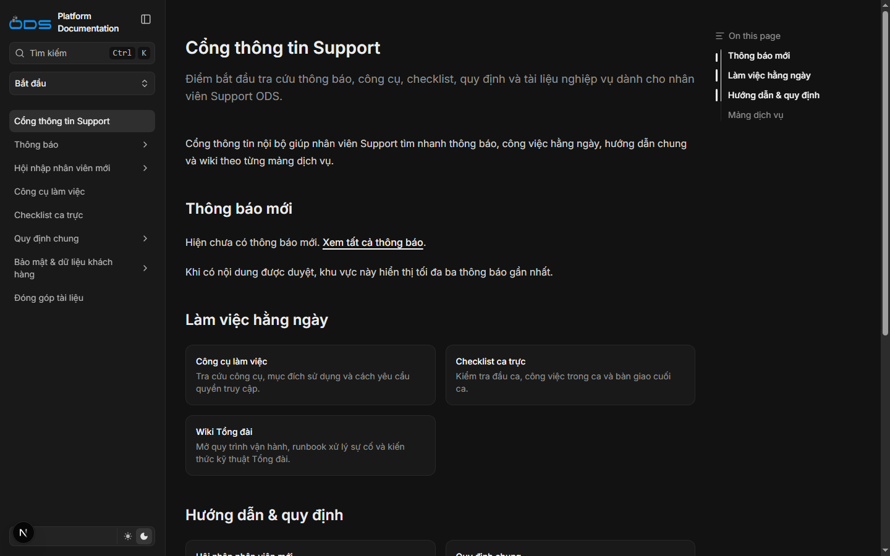
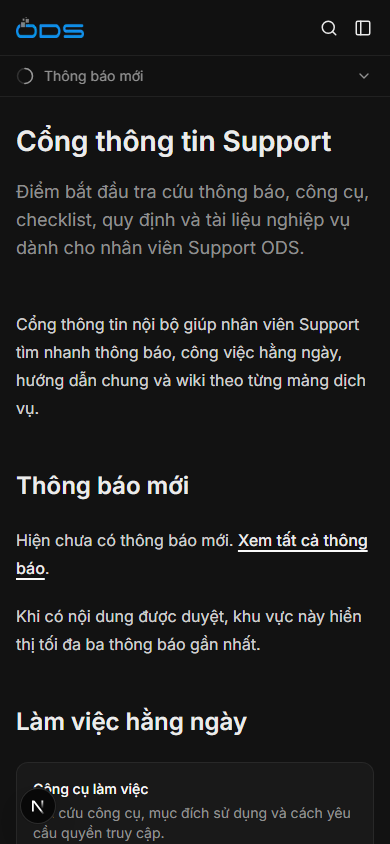
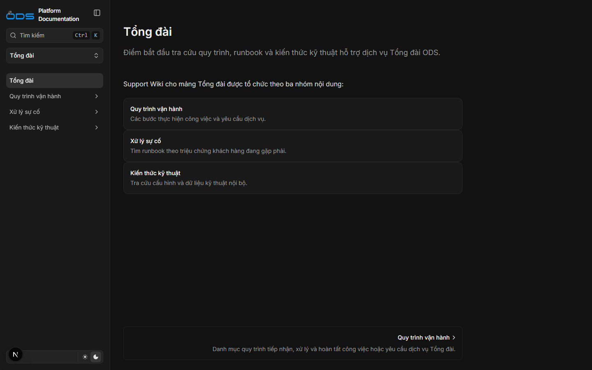
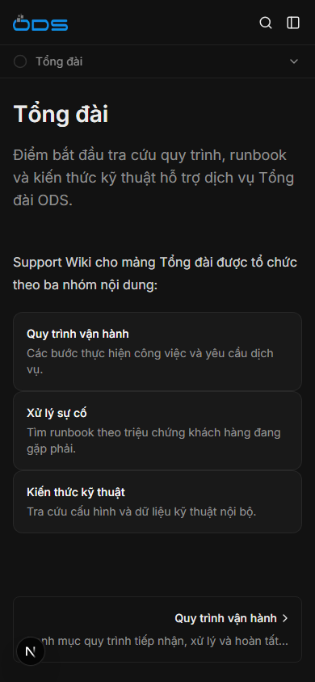
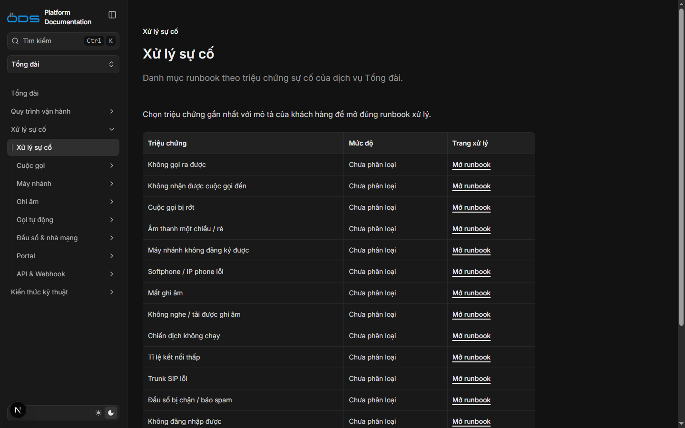
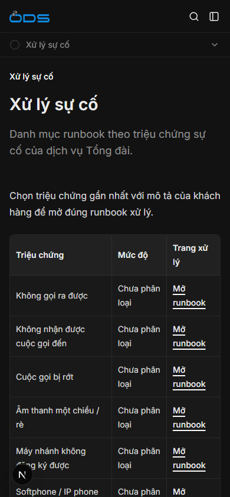

# TASK-014 — Báo cáo nghiệm thu Support Wiki `/internal`

## Trạng thái

- Branch: `task/TASK-014-internal-ia`
- Task status: `in-progress`
- Base sau `git fetch` và `git rebase origin/main`: `362e56a`
- Không sửa auth, Proxy, internal layout, source loader, search handler, test hoặc dependency.
- Dev server preview tiếp tục chạy tại `http://localhost:3000` với `ODS_INTERNAL_DEV_OPEN=true`.

## Phạm vi đã thực hiện

- Quy hoạch `content/internal/**` thành hai root `Bắt đầu` và `Tổng đài`.
- Tạo 42 trang MDX và 18 file `meta.json`.
- Mảng Tổng đài có tám quy trình, 16 runbook và sáu trang knowledge base, ngoài các landing page.
- Hoàn thiện `Cổng thông tin Support` với Thông báo, Công cụ làm việc và Checklist ca trực.
- Chuẩn hóa ba nhãn điều hướng Tổng đài thành `Quy trình vận hành`, `Xử lý sự cố` và `Kiến thức kỹ thuật` mà không đổi URL.
- Xóa bốn placeholder cũ; `/internal/runbook` và `/internal/quy-trinh` không có redirect.
- Thêm ADR-006 và cập nhật policy dữ liệu internal trong `AGENTS.md`.
- Link checker nhận route group và literal JSX `href` cho `/docs` hoặc `/internal`.

## Commits theo phase

| Phase | Commit | Nội dung |
|---|---|---|
| Plan | `2e7393a` | `docs(task-014): add implementation plan` |
| A | `6388f33` | `feat(internal): define support wiki governance` |
| B | `3f06c4f` | `feat(internal): add support wiki roots` |
| C | `a6c85df` | `docs(internal): add support process templates` |
| D | `af72d36` | `docs(internal): add incident runbook templates` |
| E | `a4c543d` | `docs(internal): add technical knowledge templates` |
| F | `0310782` | `docs(internal): record task 014 verification` |
| G — Plan | `85def40` | `docs(task-014): extend support hub plan` |
| G — Content | `4d74345` | `docs(internal): refine support wiki navigation` |

## Kết quả kiểm tra theo phase

Mỗi phase đã chạy thật `npm run verify:task`, `git diff --check` và kiểm tra worktree trước khi commit.

| Phase | Static pages | Route tests | Kết quả |
|---|---:|---:|---|
| A | 197/197 | 12/12 | PASS |
| B | 199/199 | 12/12 | PASS |
| C | 208/208 | 12/12 | PASS |
| D | 225/225 | 12/12 | PASS |
| E | 232/232 | 12/12 | PASS |
| G | 235/235 | 12/12 | PASS |

Các lần chạy đều PASS type generation, TypeScript, env guard, link checker, guard, scope checker, production build và route tests. Build còn warning `metadataBase` dùng `http://localhost:3000`; đây là warning có sẵn, không làm fail build.

## Runtime dev

Kiểm tra bằng HTTP client trên dev server port 3000:

- 42/42 route MDX internal trả `200`; không có route thất bại.
- `/internal/runbook` trả `404`.
- `/internal/quy-trinh` trả `404`.
- `/api/search/internal?query=Không gọi ra được` trả route `/internal/ai-contact-center/runbooks/calls/outbound-failed`.
- Internal search trả đúng `/internal/announcements`, `/internal/tools` và `/internal/shift-checklist` theo title tương ứng.
- Cùng query trên `/api/search` không chứa `/internal`.
- `/llms.txt` không chứa `/internal`.
- `/sitemap.xml` tiếp tục trả `404`; repo chưa triển khai sitemap.
- HTML `/internal` có metadata `noindex, nofollow`.
- Landing runbook có đúng 16 dòng `Chưa phân loại` và 16 link xử lý.
- Cả 16 runbook có mục `Tra cứu liên quan` trỏ tới trang knowledge base cụ thể.

## Runtime production fail-closed

Validation server được chạy trên port 3101 trong shell xác nhận `ODS_INTERNAL_DEV_OPEN_PRESENT=False`. Kết quả:

| Route | Status | Cache-Control | X-Robots-Tag |
|---|---:|---|---|
| `/internal` | 401 | `private, no-store, must-revalidate` | `noindex, nofollow` |
| `/internal/announcements` | 401 | `private, no-store, must-revalidate` | `noindex, nofollow` |
| `/internal/tools` | 401 | `private, no-store, must-revalidate` | `noindex, nofollow` |
| `/internal/shift-checklist` | 401 | `private, no-store, must-revalidate` | `noindex, nofollow` |
| `/internal/ai-contact-center` | 401 | `private, no-store, must-revalidate` | `noindex, nofollow` |
| `/internal/ai-contact-center/runbooks/calls/outbound-failed` | 401 | `private, no-store, must-revalidate` | `noindex, nofollow` |
| `/internal/runbook` | 401 | `private, no-store, must-revalidate` | `noindex, nofollow` |
| `/api/search/internal` | 401 | `private, no-store, must-revalidate` | `noindex, nofollow` |

Validation server port 3101 đã được tắt sau kiểm tra. Dev server port 3000 không bị tắt.

## Screenshot và viewport

Chrome DevTools Protocol được dùng để đặt device metrics thật và đo overflow. Cả ba route đều có `scrollWidth <= clientWidth` trên desktop `1440×900` và mobile `390×844`.

### `/internal`

### `/internal/ai-contact-center`

### `/internal/ai-contact-center/runbooks`

## Console và giới hạn còn lại

- Không ghi nhận JavaScript exception, `console.error` hoặc browser log error trên sáu lượt kiểm tra Phase G.
- Lần nghiệm thu Phase F từng ghi nhận `favicon.ico` trả `404`. Repo vẫn không có favicon và `public/**` nằm ngoài scope TASK-014; lỗi này không xuất hiện lại trong lượt CDP Phase G.
- Nội dung nghiệp vụ hiện là template; SLA, mức độ sự cố, nguồn chuẩn, người cập nhật, IP và bảng đầu số thật chưa được điền.
- Task giữ `in-progress`; CI trên Pull Request và Human finalization chưa diễn ra.

## Final verification

- `npm run verify:task`: PASS — 235/235 static pages, 12/12 route tests; report và screenshot đã có trong worktree khi chạy.
- `git diff --check`: PASS sau khi cập nhật evidence cuối.
- `git status --short`: chỉ còn report và sáu screenshot trước commit evidence Phase G.
