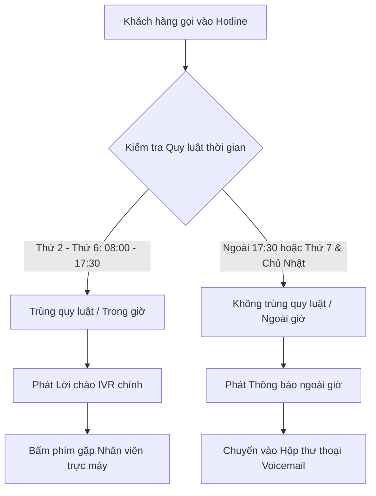

Tính năng **Điều hướng cuộc gọi theo quy luật thời gian (Time Conditions)** cho phép doanh nghiệp tự động thay đổi kịch bản tiếp nhận cuộc gọi tùy theo từng khung giờ trong ngày, các ngày trong tuần hoặc các dịp nghỉ lễ/tết đặc biệt. Nhờ đó, cuộc gọi trong giờ hành chính sẽ được chuyển ngay đến tổng đài viên trực máy, trong khi cuộc gọi ngoài giờ sẽ tự động phát thông báo hướng dẫn hoặc thu thập lời nhắn thư thoại (Voicemail).

---

## 1. Tổng quan & Điều kiện tiên quyết

### Mục đích & Đối tượng áp dụng
- **Mục đích:** Tự động hóa phân luồng cuộc gọi vào tổng đài theo lịch làm việc thực tế của doanh nghiệp mà không cần nhân viên trực can thiệp thủ công khi hết ca.
- **Đối tượng áp dụng:** Quản trị viên hệ thống (**Administrator**), Trưởng bộ phận dịch vụ khách hàng (**Supervisor**).

Phân hệ **Thời gian gọi** trên Portal ODS bao gồm 2 cấu phần chính:
1. **Quy luật thời gian (Time Groups):** Định nghĩa các khoảng thời gian cụ thể (Giờ bắt đầu/kết thúc, ngày trong tuần từ Thứ Hai đến Chủ Nhật, ngày trong tháng, các tháng trong năm).
2. **Điều hướng cuộc gọi (Time Conditions):** Ghép nối quy luật thời gian với các đích đến tương ứng:
   - *Khi trùng quy luật (Match):* Chuyển vào luồng trong giờ làm việc (VD: Lời chào IVR chính, Nhóm CSKH trực tiếp).
   - *Khi không trùng quy luật (Unmatch / Failover):* Chuyển vào luồng ngoài giờ (VD: Thông báo ngoài giờ, Hộp thư thoại, hoặc số di động trực ban).

### Điều kiện tiên quyết (Prerequisites)
- Tài khoản quản trị đã đăng nhập thành công vào Portal [https://app.ods.vn](https://app.ods.vn).
- Đã chuẩn bị sẵn các [Lời chào & Thông báo](/docs/ai-contact-center/user-guider-portal/04-thiet-lap-tong-dai/cai-dat/loi-chao-thong-bao-hop-thu-thoai) (File lời chào trong giờ và thông báo ngoài giờ).
- Đã cấu hình danh sách [Nhóm nhân viên](/docs/ai-contact-center/user-guider-portal/04-thiet-lap-tong-dai/cai-dat/cau-hinh-nhom-nhan-vien) tiếp nhận cuộc gọi.

---

## 2. Bảng thông số cấu hình chi tiết

### Bảng tham số Quy luật thời gian (Time Rule Settings)

| Tên trường | Loại trường | Bắt buộc | Diễn giải & Tùy chọn cấu hình |
| :--- | :--- | :---: | :--- |
| **Tên danh mục** | Text Input | **Có** | Tên gợi nhớ đại diện cho khung thời gian (VD: `Gio_Hanh_Chinh`, `Ca_Dem`, `Nghi_Le_Tet`). |
| **Thời gian bắt đầu** | Time Selector | **Có** | Giờ và phút bắt đầu khung thời gian làm việc (VD: `08:00`). |
| **Thời gian kết thúc** | Time Selector | **Có** | Giờ và phút kết thúc khung thời gian làm việc (VD: `17:30`). |
| **Chọn Thứ** | Multi-select / Day Range | **Có** | Chọn các ngày làm việc trong tuần (VD: `Thứ 2 - Thứ 6`, hoặc `Thứ 2 - Thứ 7`). |
| **Chọn Ngày** | Day Range | Tùy chọn | Áp dụng cho các ngày cụ thể trong tháng (VD: `1 - 31`, hoặc chọn ngày lễ như `30/04 - 01/05`). |
| **Chọn Tháng** | Month Selector | Tùy chọn | Áp dụng cho các tháng cụ thể trong năm (để trống hoặc `Tất cả` nếu áp dụng quanh năm). |

### Bảng tham số Điều hướng cuộc gọi (Time Condition Routing)

| Tên trường | Loại trường | Bắt buộc | Diễn giải & Tùy chọn cấu hình |
| :--- | :--- | :---: | :--- |
| **Tên hiển thị** | Text Input | **Có** | Tên đại diện cho điều hướng (VD: `Dieu_Huong_Hotline_Chinh`). |
| **Chọn quy luật thời gian** | Dropdown | **Có** | Lựa chọn quy luật thời gian đã tạo ở phần trước (VD: `Gio_Hanh_Chinh`). |
| **Chuyển hướng khi trùng quy luật** | Cascading Dropdown | **Có** | Đích đến tiếp nhận khi cuộc gọi vào **trong khung giờ quy định** (VD: Chọn `Lời chào` > `LC_Chinh` hoặc `Nhóm` > `1000 <CSKH>`). |
| **Chuyển hướng khi không trùng quy luật** | Cascading Dropdown | **Có** | Đích đến tiếp nhận khi cuộc gọi vào **ngoài khung giờ quy định** (VD: Chọn `Thông báo` > `TB_Ngoai_Gio` hoặc `Hộp thư thoại`). |

---

## 3. Hướng dẫn thao tác từng bước

<Steps>
  <Step>
    ### Bước 1: Tạo Danh mục Quy luật thời gian

    1. Từ menu bên trái Portal, chọn **Tổng đài** > **Cài đặt tổng đài** > **Thời gian gọi**. Mặc định hiển thị tab **Quy luật thời gian**.
    2. Nhấn nút **+ THÊM DANH MỤC** ở góc trên.
    3. Nhập tên danh mục (VD: `GioLamViec_T2_T6`) và nhấn **Lưu**.

    
  </Step>

  <Step>
    ### Bước 2: Thiết lập chi tiết mốc giờ & ngày làm việc

    1. Tại bảng danh sách quy luật thời gian, chọn danh mục vừa tạo để mở bảng thông số chi tiết.
    2. Thiết lập khung giờ:
       - **Thời gian bắt đầu:** `08:00`.
       - **Thời gian kết thúc:** `17:30`.
       - **Chọn Thứ:** Chọn từ `Thứ 2` đến `Thứ 6`.
       - **Chọn Ngày & Tháng:** Để mặc định tất cả nếu áp dụng hàng tuần.
    3. Nhấn **Lưu cấu hình** để hoàn tất.

    
  </Step>

  <Step>
    ### Bước 3: Tạo mới Điều hướng cuộc gọi theo thời gian

    1. Chuyển sang tab **Điều hướng cuộc gọi** (kế bên tab Quy luật thời gian).
    2. Nhấn nút **+ THÊM MỚI ĐIỀU HƯỚNG CUỘC GỌI**.
    3. Nhập **Tên hiển thị** (VD: `Dieu_Huong_Hotline_1900`).
    4. Chọn **Quy luật thời gian:** `GioLamViec_T2_T6`.

    
  </Step>

  <Step>
    ### Bước 4: Thiết lập đích đến Trong giờ & Ngoài giờ

    1. **Chuyển hướng cuộc gọi khi trùng quy luật (Trong giờ):**
       - Chọn loại đích: `Lời chào`.
       - Chọn đích đến: `LC_Chinh_CongTy` (Khách nghe menu IVR phân nhánh).
    2. **Chuyển hướng cuộc gọi khi không trùng quy luật (Ngoài giờ):**
       - Chọn loại đích: `Thông báo`.
       - Chọn đích đến: `TB_Ngoai_Gio_Lam_Viec` (Phát thông báo hẹn liên hệ lại vào 8h00 sáng hôm sau hoặc chuyển tiếp vào Hộp thư thoại).
    3. Nhấn **+ THÊM MỚI** để lưu kịch bản điều hướng.
  </Step>

  <Step>
    ### Bước 5: Gán Điều hướng thời gian vào Định tuyến gọi vào

    Để quy luật có hiệu lực với khách hàng gọi vào Hotline:
    1. Truy cập mục **Định tuyến** > Tab **Gọi vào**.
    2. Chỉnh sửa tuyến gọi vào của đầu số Hotline.
    3. Tại mục **Chuyển cuộc gọi**, chọn loại đích đến là `Thời gian gọi` và chọn tên điều hướng vừa tạo (`Dieu_Huong_Hotline_1900`).
    4. Nhấn **CẬP NHẬT**.
  </Step>
</Steps>

---

## 4. Ví dụ Kịch bản Vận hành Doanh nghiệp Thực tế

---

## 5. Lưu ý & Xử lý sự cố (Troubleshooting)

### Lưu ý quan trọng

<Callout type="warn">
  **Khuyến cáo cấu hình thời gian:**
  - Hãy kiểm tra múi giờ của hệ thống Portal luôn ở định dạng **GMT+7 (Giờ Việt Nam)** để đảm bảo quy tắc đóng/mở tổng đài chính xác theo thời gian thực.
  - Khi có các dịp nghỉ lễ dài ngày (Tết Âm lịch, Lễ 30/4 - 1/5), nên tạo riêng một danh mục quy luật thời gian nghỉ lễ với độ ưu tiên cao nhất để không ảnh hưởng đến lịch chạy định kỳ hàng tuần.
</Callout>

### Sự cố thường gặp & Khắc phục nhanh

- **Trong giờ làm việc nhưng khách hàng gọi vào vẫn nghe thông báo ngoài giờ:**
  - *Nguyên nhân:* Mốc giờ kết thúc trong quy luật thời gian bị cấu hình nhầm (VD: nhầm định dạng 12h/24h) hoặc ngày hiện tại chưa được tích chọn trong danh sách các Thứ trong tuần.
  - *Khắc phục:* Mở lại danh mục thời gian trong mục **Quy luật thời gian**, kiểm tra lại khung giờ từ - đến và danh sách các ngày trong tuần.
- **Cuộc gọi ngoài giờ bị ngắt ngay sau khi chuông reo:**
  - *Nguyên nhân:* Mục **Chuyển hướng cuộc gọi khi không trùng quy luật** bị để trống hoặc trỏ vào file âm thanh đã bị xóa.
  - *Khắc phục:* Chọn lại một file thông báo hợp lệ hoặc chuyển hướng cuộc gọi vào Hộp thư thoại.
